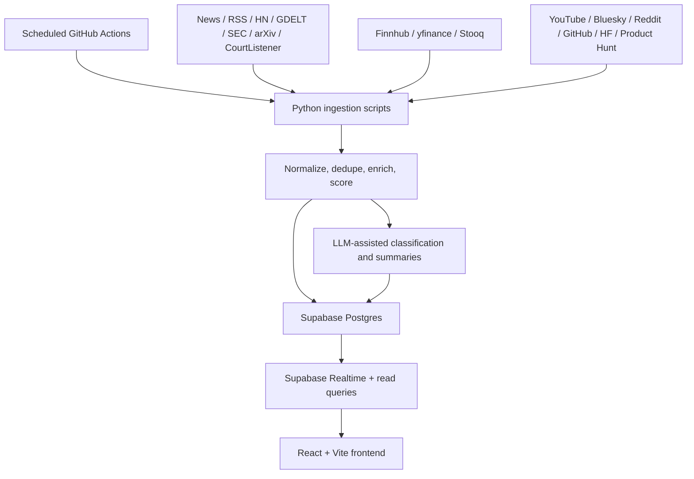

# Tech-Intel

Tech-Intel is my attempt to build the kind of tech-investor dashboard I wish already existed: one place that tracks what important tech companies are doing, what people are saying about them, and whether the signal is actually backed by reality.

Right now the project tracks **120 tech companies** across public and private markets, pulls from multiple free and low-cost data sources, processes everything on scheduled **GitHub Actions**, stores it in **Supabase**, and serves it through a **Vite + React** frontend.

**Status:** still in active development. The core product works, but I’m still tightening data quality, deployment, and polish.

**Live link:** `TODO: add Vercel URL here`

## What this project is trying to do

A lot of tech coverage is noisy:

- headlines get repeated without context
- hype spreads faster than verification
- product launches, research, filings, insider trades, and creator commentary all live in different places

This project tries to pull those streams together into one investor-facing view so you can answer questions like:

- What changed today for a company I care about?
- Is this real traction or just narrative momentum?
- Are insiders buying or selling?
- Is the market reacting before fundamentals show up?
- Are creators and social accounts early, right, wrong, or just loud?

## What it does today

- Tracks **120 companies**
- Monitors **34 influencer accounts** total:
  - **28 YouTube channels**
  - **6 Bluesky accounts**
- Runs scheduled ingestion and processing jobs in **GitHub Actions**
- Stores data in **Supabase Postgres**
- Shows a live frontend built with **React + Vite**
- Supports:
  - news and signal feeds
  - market maps for public and private companies
  - company detail views
  - hype vs reality charts
  - earnings and insider-trade views
  - research/arXiv tracking
  - controversy/lawsuit tracking via CourtListener
  - daily investor digest generation
  - realtime news inserts via Supabase Realtime
  - status/health visibility in the app

## Tech stack

### Frontend

- **React 18**
- **Vite 5**
- **Supabase JS**
- **Recharts**
- **Lucide React**

### Data + infrastructure

- **Supabase** for Postgres, Realtime, and public-read app queries
- **GitHub Actions** for all scheduled ingestion / processing
- **Python scripts** for collectors, enrichment, scoring, and digest generation

### LLM layer

Used selectively for classification, summarization, dispute handling, influencer validation, and digest generation.

Current default provider chain in code:

- **Groq** as primary
- **Gemini** as fallback

Optional providers like **Cerebras** and **OpenRouter** are only used if you explicitly add them to `LLM_PROVIDER_CHAIN`.

## Data sources and APIs in use

This project intentionally leans on practical, mostly free sources.

### Market and company data

- **Finnhub** - stock quotes, company profiles, company news, insider transactions, earnings calendar, analyst signals
- **yfinance** - fallback market data
- **Stooq** - fallback CSV price coverage for some tickers Finnhub/yfinance miss

### News and research

- **TheNewsAPI**
- direct **RSS feeds** from major tech publications
- **Hacker News**
- **GDELT**
- **SEC EDGAR** 8-K feed
- **arXiv**
- **CourtListener / Free Law Project**

### Community, creator, and product signals

- **YouTube Data API**
- **Bluesky**
- **Reddit RSS**
- **GitHub API / GraphQL**
- **Hugging Face**
- **Product Hunt**

## How the system works



## Active scheduled workflows

These are the workflows currently wired in the repo.

| Workflow | Cadence | Purpose |
|---|---|---|
| `ingest_stocks.yml` | Tier 1 `*/15`, Tier 2 `*/30`, Tier 3 `0 */2 * * *` | Stock snapshots and company market data by priority tier |
| `ingest_hackernews.yml` | `*/20 * * * *` | Hacker News polling |
| `ingest_firehoses.yml` | `0 * * * *` | GDELT, SEC, arXiv, CourtListener-style firehose sources |
| `ingest_and_process.yml` | `5 */6 * * *` | Reddit, YouTube, GitHub, Bluesky, Product Hunt, Hugging Face ingestion |
| `llm_followups.yml` | `30 */6 * * *` | LLM batch post-processing and influencer-trust validation after ingest has settled |
| `ingest_finnhub_extras.yml` | `30 22 * * *` | Insider trades, earnings calendar, analyst recommendation data |
| `daily_digest.yml` | `20 2 * * *` | Daily investor digest generation |
| `supabase_keepalive.yml` | `0 */12 * * *` | Keepalive, cleanup, maintenance-style jobs |

There are also manual-only workflows in the repo for targeted runs like `ingest_news.yml` and `run_llm_batch.yml`.

## Useful sections depending on who you are

### If you’re a recruiter or hiring manager

This is a full-stack, data-heavy product project. The interesting parts are:

- scheduled data pipelines
- noisy-source normalization and deduplication
- investor-oriented product thinking
- Supabase as the operational backbone
- frontend work around dense, real data instead of mock screens

### If you’re an engineer

Start with:

- `frontend/` for the app
- `scripts/` for ingestion and enrichment
- `supabase/schema.sql` for the data model
- `.github/workflows/` for how the system actually runs

### If you’re evaluating the product idea

The core bet is simple: tech investing gets easier when narrative, filings, research, market action, and creator commentary are visible in one place and ranked with some skepticism instead of just volume.

## Local development

### 1. Frontend

```bash
cd frontend
npm install
npm run dev
```

The frontend expects:

- `VITE_SUPABASE_URL`
- `VITE_SUPABASE_ANON_KEY`

in `frontend/.env.local`.

### 2. Python environment for ingestors

From the repo root:

```bash
python3 -m venv .venv
source .venv/bin/activate
pip install -r scripts/requirements.txt
```

### 3. Run an ingestor manually

Examples:

```bash
python3 -m scripts.ingest_stocks
python3 -m scripts.ingest_hackernews
python3 -m scripts.generate_daily_digest
```

### 4. Tests

```bash
PYTHONPATH=scripts pytest tests/ -q
```

## Current reality, plainly

- This is **not** a traditional backend app with a long-running API server.
- The system is built around **scheduled jobs + Supabase + a direct frontend client**.
- The tracked universe is **120 companies**, not the older smaller set.
- The project is **still in development**, especially around deployment, monitoring, and polish.

## What I still want to improve

- production deployment on Vercel
- tighter monitoring and error reporting
- more polished public documentation
- continued data-quality cleanup for edge cases and ambiguous entity matching

## Why I built it this way

I wanted something cheap to run, fast to iterate on, and realistic enough to behave like a real product instead of a portfolio mockup. GitHub Actions + Supabase + Vite turned out to be a good fit for that.
