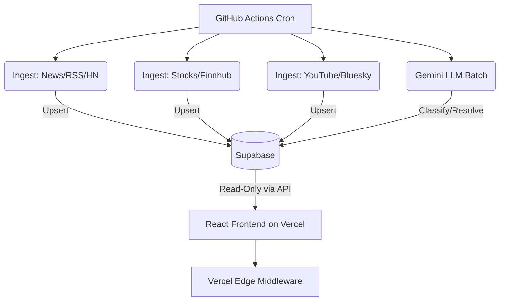

# Tech-Intel v2

Tech-Intel is an autonomous tech news, intelligence, and benchmarking platform.

It is built as a **zero-cost serverless** application using:
- **GitHub Actions**: Background cron workers tracking 40+ influencers, 100+ tech companies, and 5 subreddits.
- **Supabase**: Real-time Postgres database for all news and stock data.
- **Vercel Edge**: Ultra-fast React frontend connecting directly to Supabase with edge rate limiting.
- **Google Gemini**: Large Language Model batch processor to detect hype, classify news, and resolve conflicting benchmark claims.

## Key Features

1. **Autonomous Ingestion System**: Python scripts run on a tiered polling schedule (15min / 1hr / 6hr) dynamically promoting companies to higher tiers when they generate buzz to preserve API quota.
2. **Consensus Engine**: If two news sources contradict each other (e.g. Model A vs Model B benchmarks), the system automatically flags it with a "⚠️ Disputed" badge and writes an unbiased, cited brief.
3. **Hype vs Reality Meter**: Detects overhyped startups by measuring their news volume against actual product traction (GitHub stars/releases, earnings signals).
4. **Influencer Trust Scores**: Tracks track records of YouTubers and commentators. If they repeatedly make false claims about tech, their confidence weighting decays from 0.60 to 0.05.

## Architecture



## Setup Guide

To deploy your own free instance of this platform, see:
1. `docs/free_api_setup.md` - Getting the free keys
2. `docs/deployment_guide.md` - Pushing to Vercel and configuring actions.

## Local Development

**Frontend (React/Vite)**
```bash
cd frontend
npm install
npm run dev
```

**Backend (Python)**
```bash
python3 -m venv .venv
source .venv/bin/activate
pip install -r scripts/requirements.txt
# Set environment variables from docs first
python3 -m scripts.ingest_news
```

## Legacy Architecture (v1)
The original v1 architecture utilizing FastAPI, Apache Kafka, and a traditional Web Server can still be found in the `/backend` directory. However, to eliminate hosting costs and handle the 60req/min Finnhub limits better, v2 relies entirely on Supabase + GitHub Actions.
